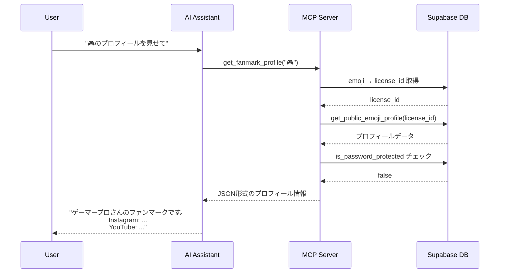

# MCP統合設計書

## 目的

ファンマーク（絵文字URL）を生成AI（Claude、ChatGPT等）から直接アクセス可能にすることで、ドメイン認知のハードルを下げ、新しいディストリビューション経路を確立する。

## 背景・課題

### 現状の問題

1. **ドメイン認知のハードル**
   - ユーザーがファンマーク（絵文字）を知っていても、`fanmark.id` ドメインを覚えていないと辿り着けない
   - 検索エンジンでの発見も難しい（絵文字検索が主流ではない）

2. **利用シーンの限定性**
   - 人間が直接URLを入力する場面に依存
   - 自動化やプログラマティックなアクセスが困難

3. **既存機能の活用不足**
   - プロフィール、リダイレクト、メッセージボードという優れた機能があるが、発見されにくい
   - AIアシスタントから「🎮のプロフィールを見せて」と言っても何も起きない

### MCP統合によるソリューション

**MCP (Model Context Protocol)** を通じて、AIアシスタントがファンマークの情報に直接アクセスできるようにする。

**重要な方向性転換**:
- ❌ 「取得可能性の確認」ツール中心 → ⭐ **既存ファンマークへのアクセス**を最優先
- AIアシスタントがファンマークの「案内役」として機能
- ユーザーは絵文字を覚えるだけで、プロフィール・リンク・メッセージにアクセスできる

## ユースケース

### 🔥 最優先: 既存ファンマークへのアクセス

#### 1. プロフィール情報の取得
```
ユーザー: "🎮のプロフィールを見せて"

AI (MCP経由):
  → ファンマーク所有者: @gamer_pro
  → プロフィール: ゲーム実況者です。毎日配信中！
  → Instagram: instagram.com/gamer_pro
  → YouTube: youtube.com/@gamerpro
  → Twitch: twitch.tv/gamerpro
  → 公式サイト: gamerpro.com
```

#### 2. リダイレクト先の取得
```
ユーザー: "🍕のリンク先は？"

AI (MCP経由):
  → リダイレクト先: pizzashop.com/menu
  → 今すぐアクセスしますか？ [リンクを開く]
```

#### 3. メッセージボードの確認
```
ユーザー: "📢に何か書いてある？"

AI (MCP経由):
  → メッセージボード: 次回イベントは12月25日です！
  → 詳細はWebサイトで確認してください。
```

### 💡 副次的: ファンマークの探索

#### 4. 所有状況の確認
```
ユーザー: "🎸は誰が使ってる？"

AI (MCP経由):
  → ステータス: まだ誰も取得していません
  → 価格: ¥1,500/月（Tier 1）
  → 取得しますか？ [fanmark.id で取得する]
```

## MCPツール定義

### Tool 1: `get_fanmark_profile` ⭐ 最優先

**目的**: ファンマーク保有者のプロフィール情報取得

**入力スキーマ**:
```json
{
  "type": "object",
  "properties": {
    "emoji": {
      "type": "string",
      "description": "ファンマークの絵文字（例: 🎮）"
    },
    "include_owner_info": {
      "type": "boolean",
      "default": true,
      "description": "所有者の基本情報も含めるか"
    }
  },
  "required": ["emoji"]
}
```

**出力例**:
```json
{
  "fanmark": "🎮",
  "owner": {
    "username": "gamer_pro",
    "display_name": "ゲーマープロ"
  },
  "profile": {
    "display_name": "ゲーマープロのファンマーク",
    "bio": "ゲーム実況者です。毎日配信中！",
    "social_links": {
      "instagram": "https://instagram.com/gamer_pro",
      "youtube": "https://youtube.com/@gamerpro",
      "twitch": "https://twitch.tv/gamerpro",
      "website": "https://gamerpro.com"
    },
    "theme_settings": {
      "cover_image_url": "https://...",
      "profile_image_url": "https://..."
    }
  },
  "access_type": "profile",
  "is_public": true
}
```

**既存コードの活用**:
- `get_public_emoji_profile()` データベース関数
- `src/hooks/useEmojiProfile.tsx` のロジック
- `fanmark_profiles` テーブル

**セキュリティ考慮事項**:
- `is_public = false` の場合、プロフィール詳細を返さない
- パスワード保護されている場合は基本情報のみ返す
- 非公開プロフィールの場合: `{ "fanmark": "🎮", "is_public": false, "message": "このプロフィールは非公開です" }`

---

### Tool 2: `get_fanmark_redirect` ⭐ 高優先度

**目的**: リダイレクト型ファンマークの転送先URL取得

**入力スキーマ**:
```json
{
  "type": "object",
  "properties": {
    "emoji": {
      "type": "string",
      "description": "ファンマークの絵文字（例: 🍕）"
    }
  },
  "required": ["emoji"]
}
```

**出力例**:
```json
{
  "fanmark": "🍕",
  "access_type": "redirect",
  "target_url": "https://pizzashop.com/menu",
  "fanmark_name": "ピザショップ公式",
  "owner": {
    "username": "pizzashop_official"
  }
}
```

**既存コードの活用**:
- `get_fanmark_complete_data()` データベース関数
- `fanmark_redirect_configs` テーブル

---

### Tool 3: `get_fanmark_message` ⭐ 高優先度

**目的**: メッセージボード型ファンマークのコンテンツ取得

**入力スキーマ**:
```json
{
  "type": "object",
  "properties": {
    "emoji": {
      "type": "string",
      "description": "ファンマークの絵文字（例: 📢）"
    }
  },
  "required": ["emoji"]
}
```

**出力例**:
```json
{
  "fanmark": "📢",
  "access_type": "messageboard",
  "fanmark_name": "お知らせボード",
  "content": "次回イベントは12月25日です！詳細はWebサイトで確認してください。",
  "owner": {
    "username": "event_organizer"
  }
}
```

**既存コードの活用**:
- `fanmark_messageboard_configs` テーブル
- `get_fanmark_complete_data()` データベース関数

---

### Tool 4: `search_fanmark` 🔹 中優先度

**目的**: ファンマークの基本情報・ステータス確認（探索用）

**入力スキーマ**:
```json
{
  "type": "object",
  "properties": {
    "emoji": {
      "type": "string",
      "description": "ファンマークの絵文字（例: 🎸）"
    }
  },
  "required": ["emoji"]
}
```

**出力例（取得可能な場合）**:
```json
{
  "fanmark": "🎸",
  "status": "available",
  "price": {
    "monthly_yen": 1500,
    "tier_level": 1
  },
  "message": "このファンマークは現在取得可能です"
}
```

**出力例（既に取得されている場合）**:
```json
{
  "fanmark": "🎸",
  "status": "taken",
  "owner": {
    "username": "musician_sam"
  },
  "access_type": "inactive"
}
```

**既存コードの活用**:
- `check_fanmark_availability()` データベース関数
- `fanmarks` テーブル
- `fanmark_tiers` テーブル

---

## アーキテクチャ

### システム構成

```
┌─────────────────────┐
│ AI Assistant        │
│ (Claude/ChatGPT)    │
└──────────┬──────────┘
           │ MCP Protocol
           ▼
┌─────────────────────┐
│ MCP Server          │
│ (Edge Function)     │
│                     │
│ - get_fanmark_profile
│ - get_fanmark_redirect
│ - get_fanmark_message
│ - search_fanmark    │
└──────────┬──────────┘
           │ Supabase Client
           ▼
┌─────────────────────┐
│ PostgreSQL Database │
│                     │
│ - fanmarks          │
│ - fanmark_profiles  │
│ - fanmark_licenses  │
│ - *_configs         │
└─────────────────────┘
```

### データフロー（プロフィール取得の例）



### セキュリティ設計

#### 1. パスワード保護されたファンマーク

**現状の仕組み**:
- `fanmark_password_configs` テーブルで管理
- `verify_fanmark_password()` 関数で検証

**MCP対応方針**:
```json
{
  "fanmark": "🔒",
  "is_password_protected": true,
  "access_type": "profile",
  "message": "このファンマークはパスワード保護されています。直接アクセスしてください: https://fanmark.id/🔒"
}
```

#### 2. 非公開プロフィール

**現状の仕組み**:
- `fanmark_profiles.is_public` フラグ
- `get_public_emoji_profile()` 関数で公開プロフィールのみ取得

**MCP対応方針**:
- `is_public = false` の場合、プロフィール詳細を返さない
- 基本情報（ファンマーク保有中、所有者ユーザー名）のみ返す

#### 3. レート制限

**Phase 1（ログのみ）**:
- アクセスログを記録し、異常なパターンを監視
- `audit_logs` テーブルに記録

**Phase 2（将来）**:
- APIキー発行機能
- キーごとのレート制限実装
- ユーザーダッシュボードでのキー管理UI

---

## 実装計画

### Phase 1: コア機能実装（Week 1-2）

#### 目標
既存ファンマークへのアクセス機能を実装

#### タスク
1. **Edge Function作成**
   - ファイル: `supabase/functions/mcp-server/index.ts`
   - MCPプロトコル準拠のエンドポイント実装
   - CORS設定

2. **MCPツール実装**
   - ✅ `get_fanmark_profile` - プロフィール取得
   - ✅ `get_fanmark_redirect` - リダイレクト先取得
   - ✅ `get_fanmark_message` - メッセージ取得

3. **既存ロジックの統合**
   - 絵文字 → emoji_ids 変換（`emojiConversion.ts`）
   - データベース関数の活用
   - セキュリティチェック（パスワード保護、公開/非公開）

4. **テスト**
   - ローカル環境でのMCPサーバーテスト
   - 各ツールの動作確認

#### 成果物
- 動作するMCP Server (Edge Function)
- 基本的な3つのツール（プロフィール、リダイレクト、メッセージ）

---

### Phase 2: 探索機能追加（Week 3）

#### 目標
ファンマークの取得可能性確認機能を追加

#### タスク
1. **`search_fanmark` ツール実装**
   - 既存の `check_fanmark_availability()` 関数を活用
   - ステータス、価格情報の取得

2. **セキュリティ強化**
   - アクセスログ記録の実装
   - 異常なアクセスパターンの監視準備

#### 成果物
- 完全な4つのMCPツールセット
- アクセスログ機能

---

### Phase 3: ドキュメント・配布（Week 4）

#### 目標
開発者向けドキュメント整備とMCPサーバーの配布準備

#### タスク
1. **開発者ドキュメント作成**
   - `docs/MCP_API_REFERENCE.md` - API仕様詳細
   - `docs/MCP_EXAMPLES.md` - 使用例集

2. **MCP設定ファイル提供**
   ```json
   {
     "mcpServers": {
       "fanmark": {
         "url": "https://ppqgtbjykitqtiaisyji.supabase.co/functions/v1/mcp-server",
         "headers": {
           "apikey": "YOUR_SUPABASE_ANON_KEY"
         }
       }
     }
   }
   ```

3. **ランディングページ作成**
   - `/developers` ページ
   - MCP機能の説明
   - セットアップガイド
   - サンプルコード

4. **Claude Desktop / Cursor 統合ガイド**
   - インストール手順
   - 設定方法
   - トラブルシューティング

#### 成果物
- 完全なドキュメントセット
- 開発者向けランディングページ
- MCP設定ファイル

---

### Phase 4: プロモーション・フィードバック収集（Week 5〜）

#### 目標
ベータテスター募集とフィードバック収集

#### タスク
1. **ベータテスター募集**
   - 開発者コミュニティ（Discord、Twitter）での告知
   - 5-10名のパワーユーザー選定

2. **フィードバック収集**
   - 使用感のヒアリング
   - バグ報告の収集
   - 機能リクエストの整理

3. **継続的改善**
   - パフォーマンス最適化
   - エラーハンドリング改善
   - ドキュメント更新

#### 成果物
- ベータテスター向けレポート
- 改善ロードマップ

---

## ビジネスモデルへの影響

### ポジティブな影響

1. **新しいユーザー層へのリーチ**
   - 開発者・パワーユーザー層
   - AIツールのヘビーユーザー

2. **「絵文字でAPI」という新しい価値提案**
   - 技術的にユニークなポジショニング
   - プログラマティックな利用の可能性

3. **B2B利用の可能性**
   - 企業内ツール統合（Slack、Discord ボット）
   - 社内情報管理システムとの連携

### リスク管理

1. **スクレイピング対策**
   - レート制限の実装（Phase 2以降）
   - 異常なアクセスパターンの監視

2. **データプライバシー**
   - パスワード保護の尊重
   - 非公開プロフィールの保護
   - GDPRコンプライアンス

3. **収益化モデルの検討**
   - 現時点: 無料でアクセス可能（ブランド認知優先）
   - 将来: API使用量ベースの課金も検討可能

---

## 技術的依存関係

### MCPプロトコル

**依存度**: 中程度
- MCPはオープン規格であり、Anthropic社以外のツールでも採用が進んでいる
- 将来的には他のAIツール（OpenAI、Google）も対応する可能性

**リスク軽減策**:
- 標準的なREST APIとしても利用可能な設計
- MCPプロトコル変更時の影響を最小化

### Supabase Edge Functions

**依存度**: 高
- 既存のSupabaseインフラを活用
- デプロイが自動化されている

**利点**:
- 追加インフラ不要
- 既存のデータベース関数を再利用可能

---

## KPI・成功指標

### Phase 1-2（実装フェーズ）
- ✅ MCPツールが全て動作する
- ✅ レスポンスタイム < 2秒
- ✅ エラー率 < 1%

### Phase 3-4（配布・フィードバック）
- 🎯 ベータテスター 5-10名
- 🎯 MCP経由のリクエスト 100回/週
- 🎯 フィードバック満足度 4/5以上

### 長期（6ヶ月後）
- 🎯 MCP経由の新規ユーザー獲得 50名/月
- 🎯 AIツールからのアクセス 1,000回/月
- 🎯 MCP機能を起点とした本家サイト訪問 20%

---

## 次のステップ

### 即座に開始可能
1. Phase 1のEdge Function作成
2. `get_fanmark_profile` ツールの実装
3. ローカル環境でのテスト

### 意思決定が必要
1. **優先順位の最終確認**
   - 本当にプロフィール・リダイレクト・メッセージが最優先か？
   - 探索機能（search_fanmark）のタイミングは適切か？

2. **リソース配分**
   - 実装にどれくらいの時間を割けるか？
   - ベータテスターの募集範囲は？

3. **収益化の検討**
   - 当面は無料でアクセス可能とするか？
   - 将来的なAPI課金モデルを視野に入れるか？

---

## 参考資料

- [Model Context Protocol (MCP) 公式仕様](https://modelcontextprotocol.io/)
- [Supabase Edge Functions ドキュメント](https://supabase.com/docs/guides/functions)
- 既存実装:
  - `src/hooks/useEmojiProfile.tsx`
  - `src/lib/emojiConversion.ts`
  - `supabase/functions/*`
