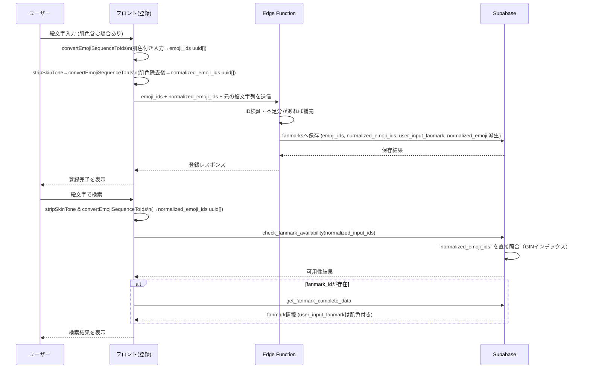

# Emoji マスタ導入検討メモ

## 現状の課題
- 絵文字を Unicode 文字列のまま扱っており、肌色修飾子・ZWJ・Variation Selector などを都度正規化する必要がある。
- Supabase RPC（例: `check_fanmark_availability`）でも正規化ロジックが散在し、仕様変更時にバグが起こりやすい。
- emoji picker（外部ライブラリ）が持つデータセットとアプリ側の前提がズレると、未対応の絵文字をユーザーが選択できてしまうリスクがある。
- 将来の分析や検索機能拡張を視野に入れると、絵文字列をそのまま保存している現状ではインデックス最適化や絞り込みが難しい。

## 修正の大方針
- アプリ内のすべての絵文字処理を ID ベースへ集約し、文字列は表示・ログなどユーザー接点に限定する。
- 絵文字を内部IDで管理する「絵文字マスタ」を導入し、アプリ内ではIDを基準に検索・比較・保存を行う。
- ユーザー入力やURLで受け取った絵文字は正規化 → マスタ照合 → 内部ID配列に変換し、以降の処理はIDベースで進める。
- 表示時のみ内部IDから絵文字列へ復元するレイヤーを設け、現状のUI/公開APIとの互換を確保する。
- マスタデータはDBをソース・オブ・トゥルースにしつつ、必要に応じてフロント向けの静的データ（ビルド成果物）も生成する運用を検討する。

## 現在の進行状況（2025-03 時点）
- ✅ `emoji_master` テーブル作成＋管理画面での CRUD / インポート機能
- ✅ Supabase → フロント用カタログ `src/data/emojiCatalog.ts` 生成スクリプト整備
- ✅ `fanmarks.emoji_ids` 追加、`register-fanmark` Edge Function を ID 前提に改修
- ✅ フロントの登録／クイック登録／取得導線／検索で `emoji_ids` を添付するよう更新
- ✅ 絵文字→ID/ID→絵文字のユーティリティをフロント用に実装
- ✅ 開発データはリセット済み（空の状態から動作確認中）
- ✅ Edge Function / RPC（延長・失効処理など）の ID 対応を完了
- ✅ 一覧／ダッシュボード表示を `emoji_ids` ベースに移行
- ⏳ 残タスク例
  - 既存の文字列カラムを派生値化／削除する段階的移行
  - カタログのコード分割や Lazy Load 等の最適化
  - 絵文字ピッカー自作（カタログ活用）

## 影響範囲（対象モジュール・処理）
- Supabase テーブル: `fanmarks`, `fanmark_licenses`, `fanmark_basic_configs` など絵文字文字列を持つカラムの再設計および移行スクリプト。
- RPC / Function: `check_fanmark_availability`, `get_fanmark_by_emoji`, `get_fanmark_complete_data` など絵文字をキーに参照する処理。
- フロントエンド: `useFanmarkSearch`, `EmojiInput`, ファンマ検索・取得・設定画面のロジックと表示。
- 外部連携: emoji picker や将来の API クライアント。マスタと同期させる仕組みの整備が必要。
- テスト / 運用: マスタ更新手順、差分検知、マイグレーション実行（開発中は全削除リセットで対応）、本番向けバックフィル手順の検討。

## 詳細の修正方針（現状の適用状況）
- **マスタ設計**: Unicode最新版をベースに絵文字IDテーブルを作成。複合絵文字は親子構造や属性テーブルで表現し、肌色・Variation Selector は属性で管理する。
  - 初期段階では `id`/`internal_id`/`emoji`/`codepoints`/`category_en`/`category_ja`/`tags` といった最小限のカラムでよい。複合かどうか、肌色バリエーションかどうかは `codepoints` から判定できるため、フラグは必要になった時点で追加する。
- ✅ `emoji_master` テーブルは作成済み（id/emoji/short_name/keywords/category/subcategory/codepoints/sort_order）
- ✅ RLS/インデックス/トリガーも導入済み
- **変換レイヤー**: 入力受付時に文字列→ID配列変換、保存・検索はIDベースで実施、出力時にID→文字列へ戻す共通ユーティリティを作成する。
- ✅ `register-fanmark` Edge Function & フロント登録フローで ID 変換済み
- ✅ `src/lib/emojiConversion.ts` と `src/data/emojiCatalog.ts` でフロント側の相互変換を実装
- ✅ Supabase 上の `emoji_master` をソース・オブ・トゥルースとして、`scripts/generate-emoji-catalog.ts` でフロント用カタログ（ID ↔ fanmark 変換辞書）を生成し、バックエンド／フロント双方が同じデータで `fanmark ↔ emoji_ids` の往復変換を行う
- ✅ 検索系 (`useFanmarkSearch`, `check_fanmark_availability` 等) も ID ベースに統一
- ⏳ 正規化用 ID 配列（`normalized_emoji_ids uuid[]`）の追加と `normalized_emoji` テキスト縮退
- **段階導入**: **現状は ID フローへ一括移行済み。** 旧 API や画面は廃止し、新しい ID ベースの処理をソース・オブ・トゥルースとして運用する。
- ✅ 管理画面タブで ID ベース更新が可能になった
- ✅ 登録/取得導線の主要フローを ID 前提で試験運用中
- **emoji picker との整合**: picker の元データをマスタ生成に流用するか、コード生成で同じソースから出力する仕組みを整え、不整合が発生した際に検知できるテストを追加する。
- ✅ `scripts/generate-emoji-catalog.ts` で Supabase から辞書を生成
- ⏳ ピッカー自体は未実装（今後自前で構築予定）
- **移行計画**: 既存レコードをID配列へ変換するバッチ、Supabase Function の再実装、RLSポリシーの見直し、API互換性テストを順次進める。必要に応じて段階的なフラグを用意する。
- ✅ データをリセットして ID 付きで再登録できる状態にした
- ✅ `check_fanmark_availability` / `get_fanmark_complete_data` の ID 対応
- ✅ 一覧画面/ダッシュボードの ID ベース化
- ⏳ 旧カラム（監査・フォールバック用途を除く）の縮退方針整理と監査
- ⏳ 正規化ステップをフロントに集約するための `normalized_emoji_ids` 導入とインデックス切り替え
- ✅ 開発環境では fanmark 系データを随時リセット可能なため、移行中はバックフィルを想定しない

#### 絵文字変換と肌色正規化の流れ（登録・検索）

- フロント登録フォームはユーザー入力の絵文字列（肌色付きも可）から `convertEmojiSequenceToIds` で `emoji_ids uuid[]` を生成し、同時に肌色除去ユーティリティで `normalized_emoji_ids uuid[]` を作り、両方と元の絵文字列を Edge Function へ送信する。
- Edge Function（`register-fanmark`）は受け取った ID を検証し、`fanmarks` に `emoji_ids` と `normalized_emoji_ids`、監査用の `user_input_fanmark` を保存する。`normalized_emoji` テキスト列は段階的廃止に備えて派生値として更新し、開発中はテーブルごとリセット可能（本番導入時のみバックフィル手順を用意）。
- フロント検索では入力をまず肌色除去し、`normalized_emoji_ids` を生成して Supabase RPC `check_fanmark_availability` に渡す。画面表示用に `emoji_ids` も必要であれば同時送信する。
- RPC 内では配列長・内容を検証し、`fanmarks.normalized_emoji_ids` を直接 GIN インデックスで照合する。文字列正規化ロジックは段階的に削除し、遷移期間中のみ `normalized_emoji` にフォールバックする。検索結果の表示には `user_input_fanmark` を使用するため、登録時の肌色は UI 上で維持される。
- ダッシュボードなどの一覧表示では `fanmarks.emoji_ids` を参照して絵文字表示を復元し、同一 ID 列の重複データをまとめ上げた上でライセンス状態に基づく並び替えを行う。

### normalized_emoji_ids (uuid[]) 導入: 現状整理と対応方針

- **現状のデータ構造**
  - `fanmarks` には `emoji_ids uuid[]` が追加済みだが、ユニーク制約は `normalized_emoji text` に依存している（`supabase/migrations/20250920073347_c7aa742a-4dbe-4a2d-99ac-86ed1881333f.sql`）。
  - Supabase 型定義でも `fanmarks.normalized_emoji` は文字列として扱われており、`normalized_emoji_ids` は未定義（`src/integrations/supabase/types.ts:424`）。
  - `check_fanmark_availability` などの RPC は `emoji_master` で絵文字列を復元 → 文字列正規化後に `normalized_emoji` へ照合している（`supabase/migrations/20251101090000_update_check_fanmark_availability_ids.sql:24-57`）。
  - Edge Function `register-fanmark` は入力絵文字列から文字列正規化を行い、`emoji_ids` と `normalized_emoji` を保存している（`supabase/functions/register-fanmark/index.ts:68-189`）。
  - フロントの `useFanmarkSearch` などは検索クエリを文字列で正規化し、RPC へ渡している（`src/hooks/useFanmarkSearch.tsx:84-189`）。

- **影響範囲の洗い出し**
  - **スキーマ**: `fanmarks` の新規カラム追加、GIN インデックス、`normalized_emoji` UNIQUE の置き換え、関連ビュー／関数の更新。
  - **RPC / Edge Function**: 引数と戻り値を `uuid[]` ベースに差し替え、文字列正規化ロジックを削除。`get_fanmark_by_emoji` ほか同様の処理を全チェック。
  - **フロントエンド**: `convertEmojiSequenceToIds` に加えて肌色除去後の `normalized_emoji_ids` を共通ユーティリティで生成し、検索・登録・表示で併用する。
  - **ユーティリティ共有**: フロント／Edge Function 双方で使える `stripSkinToneModifiers` や `toNormalizedEmojiIds` を整備し、処理の重複を排除。
  - **テスト / 検証**: 既存のスクリプト（`scripts/test-emoji-conversion.ts` 等）を拡張し、ID 正規化のラウンドトリップ検証を追加する。Supabase 側は `EXPLAIN` でインデックス利用を確認。
  - **データ運用**: 開発中は `fanmarks` を全削除して検証できるため、マイグレーション後にリセットするだけで良い。本番投入時のみバックフィル手順を別途整理。

### normalized_emoji_ids (uuid[]) 導入計画
- **スキーマ**: `fanmarks` に `normalized_emoji_ids uuid[] NOT NULL DEFAULT '{}'::uuid[]` を追加し、`emoji_ids` と同じく GIN インデックスとグローバルなユニーク制約（現状の `normalized_emoji` UNIQUE 置き換え）を設定する。既存の文字列 `normalized_emoji` は派生列として残し、完全移行後に削除する。
- **データ初期化**: 開発環境では `fanmarks` を全削除して ID 列を再生成する。本番導入時のみ `emoji_ids` から `normalized_emoji_ids` を再計算するバックフィル手順を別途整備する。
- **アプリ層**: フロントの共通ユーティリティで `emoji_ids` と `normalized_emoji_ids` を同時計算し、Edge Function/RPC へ送信する。`register-fanmark` ほか入口では ID バリデーションと配列比較のみで完結させ、文字列正規化は撤廃。
- **検索/RPC**: `check_fanmark_availability` / `get_fanmark_by_emoji` は `normalized_emoji_ids` のみに依存させ、文字列フォールバックを段階的に無効化する。インデックスが有効なことを `EXPLAIN` で確認し、引数も `uuid[]` に統一。
- **クリーンアップ**: マイグレーション完了後、`normalized_emoji` テキスト列をリードオンリー化 → 参照箇所削減 → 削除。ドキュメントとテストケースを ID ベースへ更新し、ログ・監査用には `user_input_fanmark` を継続利用する。

### 想定される修正順序
1. **絵文字マスタの初期整備**: 最新Unicodeデータからマスタを生成し、DBへの投入・更新手順を確立する。
2. **ビルド時コード生成**: マスタを元に emoji picker 用の静的データを出力する仕組みを導入し、外部ライブラリ依存から自前生成へ移行する。
3. **管理画面など内部ツールへの適用**: IDベースの絵文字編集・検索を試験導入し、API／UI の挙動を検証する。
4. **本番フローの段階的切り替え**: 検索・取得・ライセンス管理など主要ロジックを ID ベースへ置き換え、`normalized_emoji_ids uuid[]` の導入と既存データ移行を完了させる。
   - 🔄 次のアクション: 検索系 RPC/Edge Function を ID に統一／UI 側の ID ベース化
5. **互換確認と運用固め**: 旧データとの整合やフォールバックの確認、追加テスト整備、マスタ更新の運用フローを確立する。
   - ✅ カタログ生成・管理手順の原型を整備
   - ⏳ カタログのコード分割／パフォーマンス最適化・文字列カラムの派生化/削除ポリシー策定

---

## 2025-03 実装メモ

### Supabase スキーマ確定事項
- 新規テーブル `public.emoji_master`
  - `id` (uuid, PK, default `gen_random_uuid()`)
  - `emoji` (text UNIQUE, fully-qualified 表記)
  - `short_name` (text, snake_case)
  - `keywords` (text[]、短縮名から派生したタグ)
  - `category` / `subcategory` (text、Unicode group/subgroup)
  - `codepoints` (text[]、スペース区切りコードポイントを配列化)
  - `sort_order` (integer、emoji-test.txt の並び)
  - `created_at` / `updated_at`
- インデックス
  - `idx_emoji_master_short_name` (GIN, `to_tsvector('simple', short_name)`)
  - `idx_emoji_master_keywords` (keywords GIN)
  - `idx_emoji_master_category` (`category, subcategory`)
- RLS ポリシー: `public.is_admin()` を利用し、管理者のみ `FOR ALL` 操作可。
- `update_updated_at_column()` トリガーで `updated_at` 自動更新。

### 管理画面 (Admin Dashboard)
- 新タブ「絵文字マスタ」を追加。
  1. 一覧・検索（ショートネーム／絵文字）・ページング
  2. JSON/CSV インポート（500 件単位で `upsert`）
  3. 個別の追加／編集／削除フォーム
- 現在はユーザー向け機能とは独立。ID ベース運用への準備段階で使用する。

### マスタ生成フロー
- ソース: `data/emoji/emoji-test.txt` (Unicode 公式)
- 補助データ: `data/emoji/emoji-variation-sequences.txt`（Unicode UCD 配下にある VS-16 シーケンス定義。例: `https://www.unicode.org/Public/UCD/latest/ucd/emoji/emoji-variation-sequences.txt` を保存し、VS-16 付きの fully-qualified を補正する）
- 変換スクリプト: `scripts/convert-emoji-test.mjs`
  - 例: `node scripts/convert-emoji-test.mjs --format both`
  - 出力: `data/emoji/emoji-master.json` / `data/emoji/emoji-master.csv`
  - デフォルトで `fully-qualified` のみを採用。`--include-components` で component を追加可能。
- 生成ファイルを管理画面から手動インポートし、Supabase の `emoji_master` に反映。

### フロント向けカタログ生成
- スクリプト: `scripts/generate-emoji-catalog.ts`
  - 実行例: `SUPABASE_URL=... SUPABASE_SERVICE_ROLE_KEY=... node --experimental-specifier-resolution=node --experimental-strip-types scripts/generate-emoji-catalog.ts`
  - 出力: `src/data/emojiCatalog.ts`（ビルドに同梱される辞書。ID↔絵文字マッピング、カテゴリ一覧などを含む）
- Supabase のサービスロールキーを参照できない環境では生成できないため、事前に環境変数を設定する。
- フロント側の変換・絵文字ピッカーはこの辞書を参照して行う。

### 今後の予定
- ファンマ URL の絵文字列 → `emoji_master.id` 配列への変換ユーティリティ作成。
- 既存テーブル（`fanmarks` 等）の内部 ID 化と（開発中は全削除リセット／本番時のみバックフィル）計画。
- RPC / Edge Function / フロントエンドを ID ベースに移行し、本番ロジックへ統合する。
