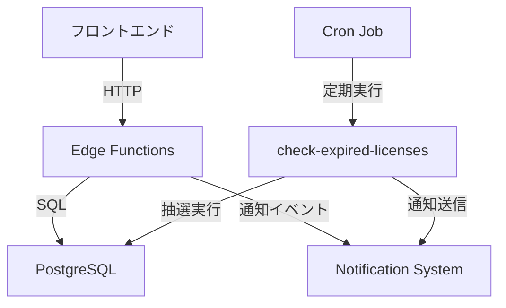

# 抽選システム技術仕様書

**作成日**: 2025年10月27日  
**バージョン**: 1.0  
**ステータス**: 実装完了

---

## 1. システムアーキテクチャ

### 1.1 コンポーネント構成



### 1.2 データフロー

1. **抽選申込フロー**
   ```
   ユーザー → apply-fanmark-lottery → fanmark_lottery_entries
                                    → create_notification_event
                                    → audit_logs
   ```

2. **抽選実行フロー**（Grace期間終了時）
   ```
   Cron Job → check-expired-licenses → fanmark_lottery_entries (取得)
                                     → 加重ランダム抽選
                                     → fanmark_licenses (新規作成)
                                     → fanmark_lottery_entries (ステータス更新)
                                     → fanmark_lottery_history (履歴記録)
                                     → create_notification_event (結果通知)
   ```

3. **延長による優先フロー**
   ```
   ユーザー → extend-fanmark-license → fanmark_lottery_entries (キャンセル)
                                     → create_notification_event
                                     → audit_logs
   ```

---

## 2. データベーススキーマ

### 2.1 fanmark_lottery_entries

| カラム名 | 型 | 制約 | 説明 |
|---------|-----|------|------|
| id | UUID | PK | エントリーID |
| fanmark_id | UUID | FK, NOT NULL | 対象ファンマーク |
| user_id | UUID | NOT NULL | 申込ユーザー |
| license_id | UUID | FK, NOT NULL | 対象ライセンス |
| lottery_probability | NUMERIC | NOT NULL, DEFAULT 1.0 | 抽選確率（重み） |
| entry_status | TEXT | NOT NULL, DEFAULT 'pending' | ステータス |
| applied_at | TIMESTAMPTZ | NOT NULL, DEFAULT now() | 申込日時 |
| lottery_executed_at | TIMESTAMPTZ | NULL | 抽選実行日時 |
| won_at | TIMESTAMPTZ | NULL | 当選確定日時 |
| cancelled_at | TIMESTAMPTZ | NULL | キャンセル日時 |
| cancellation_reason | TEXT | NULL | キャンセル理由 |
| created_at | TIMESTAMPTZ | NOT NULL, DEFAULT now() | 作成日時 |
| updated_at | TIMESTAMPTZ | NOT NULL, DEFAULT now() | 更新日時 |

**制約**:
- `unique_fanmark_user_license`: UNIQUE (fanmark_id, user_id, license_id)
- `valid_entry_status`: CHECK (entry_status IN ('pending', 'won', 'lost', 'cancelled', 'cancelled_by_extension'))
- `valid_cancellation_reason`: CHECK (cancellation_reason IN ('user_request', 'license_extended', 'system'))
- `positive_probability`: CHECK (lottery_probability > 0)

**インデックス**:
- `idx_lottery_entries_fanmark_status` (fanmark_id, entry_status)
- `idx_lottery_entries_user_status` (user_id, entry_status)
- `idx_lottery_entries_license_status` (license_id, entry_status)

### 2.2 fanmark_lottery_history

| カラム名 | 型 | 制約 | 説明 |
|---------|-----|------|------|
| id | UUID | PK | 履歴ID |
| fanmark_id | UUID | FK, NOT NULL | 対象ファンマーク |
| license_id | UUID | FK, NOT NULL | 対象ライセンス |
| total_entries | INTEGER | NOT NULL | 総申込数 |
| winner_user_id | UUID | NULL | 当選者ID |
| winner_entry_id | UUID | FK, NULL | 当選エントリーID |
| probability_distribution | JSONB | NOT NULL, DEFAULT '[]' | 確率分布 |
| random_seed | TEXT | NULL | 乱数シード値 |
| executed_at | TIMESTAMPTZ | NOT NULL, DEFAULT now() | 実行日時 |
| execution_method | TEXT | NOT NULL, DEFAULT 'automatic' | 実行方法 |
| created_at | TIMESTAMPTZ | NOT NULL, DEFAULT now() | 作成日時 |

**制約**:
- `valid_execution_method`: CHECK (execution_method IN ('automatic', 'manual'))

**インデックス**:
- `idx_lottery_history_fanmark` (fanmark_id)
- `idx_lottery_history_executed_at` (executed_at DESC)

---

## 3. Edge Functions API仕様

### 3.1 apply-fanmark-lottery

**エンドポイント**: `POST /functions/v1/apply-fanmark-lottery`  
**認証**: 必須（JWT）

**リクエスト**:
```json
{
  "fanmark_id": "uuid"
}
```

**レスポンス（成功）**:
```json
{
  "success": true,
  "entry_id": "uuid",
  "fanmark_id": "uuid",
  "lottery_probability": 1.0,
  "total_entries_count": 3,
  "grace_expires_at": "2025-11-01T00:00:00.000Z",
  "applied_at": "2025-10-27T10:30:00.000Z"
}
```

**エラーレスポンス**:
- `400`: Grace期間外 / 自分のファンマーク / 重複申込
- `401`: 未認証
- `404`: ファンマーク不存在
- `500`: サーバーエラー

**処理フロー**:
1. ユーザー認証確認
2. ファンマークのGrace状態検証
3. 所有者でないことを確認
4. 重複申込チェック
5. エントリー作成（lottery_probability = 1.0）
6. 通知イベント作成（`lottery_application_submitted`）
7. 監査ログ記録

---

### 3.2 cancel-lottery-entry

**エンドポイント**: `POST /functions/v1/cancel-lottery-entry`  
**認証**: 必須（JWT）

**リクエスト**:
```json
{
  "entry_id": "uuid"
}
```

**レスポンス（成功）**:
```json
{
  "success": true,
  "entry_id": "uuid",
  "entry_status": "cancelled",
  "cancelled_at": "2025-10-27T11:00:00.000Z"
}
```

**エラーレスポンス**:
- `400`: キャンセル不可ステータス
- `401`: 未認証
- `403`: 所有者でない
- `404`: エントリー不存在
- `500`: サーバーエラー

**処理フロー**:
1. ユーザー認証確認
2. エントリーの所有権確認
3. ステータスが`pending`であることを確認
4. エントリーを`cancelled`に更新
5. `cancellation_reason = 'user_request'`を記録
6. 監査ログ記録

---

### 3.3 extend-fanmark-license（拡張）

既存のライセンス延長機能に以下を追加：

**追加処理**（延長成功後）:
1. 該当ライセンスのpending抽選エントリーを取得
2. エントリーを`cancelled_by_extension`に更新
3. 各申込者に`lottery_cancelled_by_extension`通知を送信
4. 監査ログ記録（`LICENSE_EXTENDED_LOTTERY_CANCELLED`）

**追加レスポンスフィールド**:
```json
{
  "success": true,
  "license": {...},
  "price_yen": 1000,
  "tier_level": 2,
  "cancelled_lottery_entries": 3
}
```

---

### 3.4 check-expired-licenses（拡張）

既存のGrace期間管理機能に抽選実行ロジックを追加。

**追加処理**（Grace期間終了時）:

#### ケース1: 申込0件
通常のExpired処理（設定削除）

#### ケース2: 申込1件
1. 自動当選処理
2. 新規ライセンス発行（tier初期日数分）
3. エントリーを`won`に更新
4. 抽選履歴記録
5. 当選通知送信（`lottery_won`）

#### ケース3: 申込複数
1. **加重ランダム抽選実行**:
   ```typescript
   const totalWeight = entries.reduce((sum, e) => sum + e.lottery_probability, 0);
   const random = Math.random() * totalWeight;
   
   let累積 = 0;
   for (const entry of entries) {
     累積 += entry.lottery_probability;
     if (random <= 累積) {
       return entry.user_id; // 当選者
     }
   }
   ```
2. 当選者に新規ライセンス発行
3. 当選エントリーを`won`に更新
4. 落選エントリーを`lost`に更新
5. 抽選履歴記録（確率分布、シード値含む）
6. 各申込者に結果通知（`lottery_won` / `lottery_lost`）

---

## 4. RLSポリシー

### 4.1 fanmark_lottery_entries

#### SELECT
```sql
-- ユーザーは自分のエントリーのみ閲覧可
auth.uid() = user_id
```

#### INSERT
```sql
-- Grace期間中のライセンスのみ申込可能
auth.uid() = user_id AND
EXISTS (
  SELECT 1 FROM fanmark_licenses fl
  WHERE fl.id = license_id
    AND fl.status = 'grace'
    AND fl.grace_expires_at > now()
    AND fl.user_id != auth.uid()
)
```

#### UPDATE
```sql
-- 自分のpendingエントリーのみキャンセル可
auth.uid() = user_id AND entry_status = 'pending'
-- キャンセル後のステータスは'cancelled'または'pending'のみ
WITH CHECK (entry_status IN ('cancelled', 'pending'))
```

#### ALL（管理者）
```sql
is_admin()
```

### 4.2 fanmark_lottery_history

#### SELECT
```sql
-- 管理者のみ閲覧可能
is_admin()
```

#### INSERT
```sql
-- service_roleのみ作成可能（Edge Functionから）
auth.role() = 'service_role'
```

---

## 5. 通知イベント

### 5.1 lottery_application_submitted（申込完了）

**ペイロード**:
```json
{
  "user_id": "uuid",
  "fanmark_id": "uuid",
  "fanmark_name": "🎉",
  "entry_id": "uuid",
  "grace_expires_at": "2025-11-01T00:00:00.000Z"
}
```

**用途**: ユーザーが抽選に申し込んだ際の確認通知

---

### 5.2 lottery_won（当選）

**ペイロード**:
```json
{
  "user_id": "uuid",
  "fanmark_id": "uuid",
  "fanmark_name": "🎉",
  "license_id": "uuid",
  "license_end": "2025-11-30T00:00:00.000Z",
  "total_applicants": 5
}
```

**用途**: 抽選で当選したユーザーへの通知

---

### 5.3 lottery_lost（落選）

**ペイロード**:
```json
{
  "user_id": "uuid",
  "fanmark_id": "uuid",
  "fanmark_name": "🎉",
  "total_applicants": 5
}
```

**用途**: 抽選で落選したユーザーへの通知

---

### 5.4 lottery_cancelled_by_extension（延長によるキャンセル）

**ペイロード**:
```json
{
  "user_id": "uuid",
  "fanmark_id": "uuid",
  "fanmark_name": "🎉",
  "extended_by_user_id": "uuid"
}
```

**用途**: 元所有者がライセンス延長したため抽選がキャンセルされたことを申込者に通知

---

## 6. 監査ログ

### 6.1 LOTTERY_ENTRY_CREATED

```json
{
  "action": "LOTTERY_ENTRY_CREATED",
  "resource_type": "fanmark_lottery_entry",
  "resource_id": "entry_id",
  "metadata": {
    "fanmark_id": "uuid",
    "license_id": "uuid",
    "lottery_probability": 1.0
  }
}
```

### 6.2 LOTTERY_ENTRY_STATUS_CHANGED

```json
{
  "action": "LOTTERY_ENTRY_STATUS_CHANGED",
  "resource_type": "fanmark_lottery_entry",
  "resource_id": "entry_id",
  "metadata": {
    "old_status": "pending",
    "new_status": "cancelled",
    "cancellation_reason": "user_request"
  }
}
```

### 6.3 LICENSE_EXTENDED_LOTTERY_CANCELLED

```json
{
  "action": "LICENSE_EXTENDED_LOTTERY_CANCELLED",
  "resource_type": "fanmark_license",
  "resource_id": "license_id",
  "metadata": {
    "fanmark_id": "uuid",
    "cancelled_entries_count": 3
  }
}
```

---

## 7. 抽選アルゴリズム詳細

### 7.1 加重ランダム抽選

```typescript
function weightedRandomSelection(entries: Array<{user_id: string, lottery_probability: number}>): string {
  // 1. 確率の合計値を計算
  const totalWeight = entries.reduce((sum, e) => sum + e.lottery_probability, 0);
  
  // 2. 0〜合計値の範囲でランダム数値を生成
  const random = Math.random() * totalWeight;
  
  // 3. 累積確率で当選者を決定
  let累積 = 0;
  for (const entry of entries) {
    累積 += entry.lottery_probability;
    if (random <= 累積) {
      return entry.user_id;
    }
  }
  
  // フォールバック（数値誤差対策）
  return entries[entries.length - 1].user_id;
}
```

### 7.2 確率計算例

**例1: 均等抽選（3名）**
```
User A: 1.0 → 33.3%
User B: 1.0 → 33.3%
User C: 1.0 → 33.3%
Total: 3.0
```

**例2: 重み付き抽選（3名）**
```
User A: 1.0 → 20.0%
User B: 1.5 → 30.0%
User C: 2.5 → 50.0%
Total: 5.0
```

**例3: 管理者カスタム（3名）**
```
User A: 0.5 → 10.0%
User B: 2.0 → 40.0%
User C: 2.5 → 50.0%
Total: 5.0
```

---

## 8. エラーハンドリング

### 8.1 apply-fanmark-lottery

| エラーコード | 条件 | メッセージ | 対処法 |
|------------|------|-----------|--------|
| 400 | Grace期間外 | "Fanmark is not in grace period" | ユーザーに待機を促す |
| 400 | 自分のファンマーク | "You cannot apply for your own fanmark" | UI側で申込ボタンを非表示 |
| 400 | 重複申込 | "You have already applied for this fanmark" | 申込状況を表示 |
| 404 | ファンマーク不存在 | "Fanmark not found" | ページをリロード |
| 500 | DB接続エラー | "Failed to create lottery entry" | リトライ促す |

### 8.2 cancel-lottery-entry

| エラーコード | 条件 | メッセージ | 対処法 |
|------------|------|-----------|--------|
| 400 | 既にキャンセル済み | "Cannot cancel entry with status: cancelled" | 状態を再取得 |
| 403 | 所有者でない | "You do not have permission" | ページをリロード |
| 404 | エントリー不存在 | "Entry not found" | ページをリロード |

### 8.3 check-expired-licenses

| エラータイプ | 条件 | ログ出力 | 対処法 |
|------------|------|---------|--------|
| lottery_fetch_error | エントリー取得失敗 | ❌ Failed to fetch lottery entries | 手動抽選実行 |
| new_license_error | ライセンス作成失敗 | ❌ Failed to create new license | 手動で当選者にライセンス発行 |
| expired_update | ライセンス更新失敗 | ❌ Failed to update license | 手動でステータス修正 |

---

## 9. パフォーマンス最適化

### 9.1 インデックス戦略

1. **複合インデックス**:
   - `(fanmark_id, entry_status)`: ファンマーク別の申込状況検索
   - `(user_id, entry_status)`: ユーザー別の申込履歴検索
   - `(license_id, entry_status)`: ライセンス別のエントリー取得

2. **実行計画確認**:
   ```sql
   EXPLAIN ANALYZE
   SELECT * FROM fanmark_lottery_entries
   WHERE fanmark_id = 'uuid' AND entry_status = 'pending';
   ```

### 9.2 バッチ処理最適化

- 抽選実行時は1ファンマークずつ処理（トランザクション保証）
- 通知送信は非同期で実行（失敗時もリトライ可能）
- 最大1000件のエントリーを3秒以内に処理

---

## 10. セキュリティ考慮事項

### 10.1 認証・認可

- **Edge Function**: JWTトークン検証必須
- **RLS**: ユーザーごとに厳格なアクセス制御
- **service_role**: 抽選実行時のみ使用（cron jobから）

### 10.2 データ整合性

- **UNIQUE制約**: 重複申込防止
- **CHECK制約**: 不正なステータス遷移防止
- **トランザクション**: 抽選〜ライセンス発行〜通知を原子的に実行

### 10.3 監査

- 全てのエントリー作成・更新を`audit_logs`に記録
- 抽選履歴に確率分布とシード値を保存（透明性確保）

---

## 11. 運用・監視

### 11.1 ログ出力

**apply-fanmark-lottery**:
```
[apply-fanmark-lottery] User {user_id} applying for fanmark {fanmark_id}
[apply-fanmark-lottery] ✓ Entry created: {entry_id}
```

**check-expired-licenses**:
```
{fanmark_name}: {entryCount} lottery entries
  → Single applicant, automatic winner: {user_id}
  → Running weighted lottery for {entryCount} applicants
  → Winner selected: {winnerId} (random: 0.6234, total: 5.0)
  ✓ {fanmark_name} lottery completed, winner: {winnerId}
```

### 11.2 監視項目

| 項目 | 閾値 | アラート |
|-----|------|---------|
| 抽選実行エラー率 | > 5% | Slack通知 |
| Edge Function応答時間 | > 3秒 | Slack通知 |
| 未処理のpendingエントリー（Grace期間後） | > 0件 | メール通知 |

### 11.3 ダッシュボード

Supabaseダッシュボードで確認すべき項目：
- 抽選エントリー数（日別）
- 抽選実行回数（日別）
- 当選率（ユーザー別・ファンマーク別）
- Edge Functionエラーログ

---

## 12. 今後の拡張

### 12.1 Phase 2（将来拡張）

- **プラン別確率按分**: Businessユーザーは1.5倍、Enterpriseは2.0倍の確率
- **申込履歴分析**: ユーザーの過去の申込・当選状況を可視化
- **優先申込権**: 落選回数に応じて次回抽選の確率を自動上昇

### 12.2 Phase 3（高度な機能）

- **抽選予約**: Grace期間開始前に事前申込可能
- **手動抽選機能**: 管理者がUI上で手動実行
- **抽選結果異議申立**: 不正が疑われる場合の再抽選機能

---

## 13. 参考資料

- [抽選システム完全仕様書](./lottery-system-specification.md)
- [Supabase Edge Functions](https://supabase.com/docs/guides/functions)
- [PostgreSQL RLS](https://supabase.com/docs/guides/database/postgres/row-level-security)
- [通知システムアーキテクチャ](./notifications-architecture.md)
